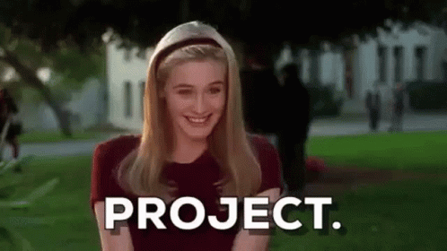

# HTML-CSS-JS 100 Projects 

Hello, Grads
This repository cosists of approx 100 HTML-CSS-JS projects. Make use it for your good.

- Numbers in filename are consider a string so, the arranging of filename is ascending order like 1,10,11,....2,20,21 etc.
- Refer the README file and click link to go directly to wanted project.

# Projects 🔛

1. Create a stunning Website Backgrounds with HTML5 and CSS3 -_[Link](https://github.com/sid-120/HTML-CSS-JS-100Projects/tree/main/1-bg-video)_

2. Dynamic Loading Animation -_[Link](https://github.com/sid-120/HTML-CSS-JS-100Projects/tree/main/2-creative-loading-animation)_

3. Modern Custom Scrollbars with CSS -_[Link](https://github.com/sid-120/HTML-CSS-JS-100Projects/tree/main/3-Modern-custom-scrollbar)_

4. Stunning Image Hover Effects with CSS3 -_[Link](https://github.com/sid-120/HTML-CSS-JS-100Projects/tree/main/4-Stunning-Image-Hover-Effect)_

5. 5 Modern and Trendy creative buttons -_[Link](https://github.com/sid-120/HTML-CSS-JS-100Projects/tree/main/5-Top-5-creative-button)_

6. Top 3 creative Navigation Menus -_[Lik](https://github.com/sid-120/HTML-CSS-JS-100Projects/tree/main/6-Navigation-Menu)_

7. Top 3 creative Image Hover Effects -_[Link](https://github.com/sid-120/HTML-CSS-JS-100Projects/tree/main/7-Creative-Image-Hover-Effect)_

8. Mind Blowing Card Design -_[Link](https://github.com/sid-120/HTML-CSS-JS-100Projects/tree/main/8.%20Card%20Design)_

9. Dynamic Tooltip text -_[Link](https://github.com/sid-120/HTML-CSS-JS-100Projects/tree/main/9.%20Dynamic%20tooltip)_

10. Creating a Accordion Project -_[Link](https://github.com/sid-120/HTML-CSS-JS-100Projects/tree/main/10.%20Accordion)_

11. Modern Scrollbar -_[Link](https://github.com/sid-120/HTML-CSS-JS-100Projects/tree/main/11.%20Modern%20Scrollbar)_

12. Background Image to Text -_[Link](https://github.com/sid-120/HTML-CSS-JS-100Projects/tree/main/12.%20Image%20To%20Text)_

13. Page Scroll Indicator - _[Link](https://github.com/sid-120/HTML-CSS-JS-100Projects/tree/main/13.%20Page%20Scroll%20Indicator)_

14. Animation Heart - _[Link](https://github.com/sid-120/HTML-CSS-JS-100Projects/tree/main/14.%20Animated%20Heart)_

15. Background Color Change - _[Link](https://github.com/sid-120/HTML-CSS-JS-100Projects/tree/main/15.%20Background%20Color%20Change)_

16. Auto Text change - _[Link](https://github.com/sid-120/HTML-CSS-JS-100Projects/tree/main/16.%20Auto%20Text)_

17. Custom Cursor - _[Link](https://github.com/sid-120/HTML-CSS-JS-100Projects/tree/main/17.%20Custom%20Cursor)_

18. Call of Duty trailer - _[Link](https://github.com/sid-120/HTML-CSS-JS-100Projects/tree/main/18.%20Trailer%20Popup)_

19. Color Toggler - _[Link](https://github.com/sid-120/HTML-CSS-JS-100Projects/tree/main/19.%20Color%20Toggler)_

20. Sidebar with DropDown: This small project has to make some changes, this project is still in the progress. NOTE: If anyone want to make changes you can. To visit - _[Link](https://github.com/sid-120/HTML-CSS-JS-100Projects/tree/main/20.%20Sidebar%20with%20Dropdown%20Menu)_

21. Weather App: -_[Link](https://github.com/sid-120/HTML-CSS-JS-100Projects/tree/main/21.%20Weather%20App)_
